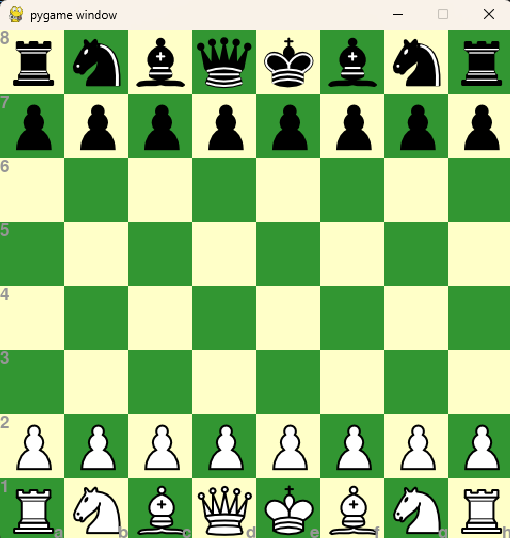

# Chess-Engine-in-Python

Building a chess engine from scratch in Python using Pygame. The goal of this project is to understand how a chess engine works internally—from board representation and move generation to game rules, search algorithms, and AI.

<p align="center">
  
</p>

---

## Features Completed

###  Project Setup
- Created a dedicated Python package for the chess engine.
- Organized the project into:
  - `ChessMain.py` – Handles the game loop, user input, rendering, and interaction.
  - `ChessEngine.py` – Maintains the game state, board representation, move execution, and move history.
  - `Pieces/` – Stores chess piece sprites used by the GUI.

---

###  Board Representation
- Implemented an 8×8 board using a 2D Python list.
- Represented each piece using two-character strings:
  - First character → Piece color (`w` / `b`)
  - Second character → Piece type (`K`, `Q`, `R`, `B`, `N`, `p`)
- Empty squares are represented as `--`.

Example:

```python
[
    ["bR","bN","bB","bQ","bK","bB","bN","bR"],
    ["bp","bp","bp","bp","bp","bp","bp","bp"],
    ...
    ["wp","wp","wp","wp","wp","wp","wp","wp"],
    ["wR","wN","wB","wQ","wK","wB","wN","wR"]
]
```

---

###  Graphical User Interface
- Built the chessboard using the **Pygame** library.
- Implemented alternating light and dark squares.
- Loaded and scaled chess piece sprites dynamically.
- Rendered the complete board every frame.

### 
---

###  User Interaction
- Added mouse-based piece selection.
- Implemented two-click move input:
  1. Select the piece.
  2. Select the destination square.
- Clicking the same square twice deselects the piece.

---

###  Move Execution
- Created a `Move` class to store:
  - Start square
  - Destination square
  - Moved piece
  - Captured piece
- Implemented move execution by updating the board state.
- Maintained a move log for future undo functionality.
- Generated standard coordinate notation (e.g., `e2e4`) for every move.
- Implemented undo functionality to send the game to previous states.
- Added move validation framework to allow only legal moves generated by the engine.

---

## Current Status

✔ Board rendering complete

✔ Piece rendering complete

✔ Mouse interaction complete

✔ Move execution complete

✔ Move notation generation complete

✔ Undo functionality

✔ Move validation framework

🚧 Piece-wise legal move generation (next milestone)

---

## Planned Features

- Generate legal moves for every piece
- Prevent illegal moves
- Check and checkmate detection
- Castling
- En passant
- Pawn promotion
- Undo move functionality
- Move validation
- Minimax search with Alpha-Beta pruning
- Board evaluation function
- AI opponent
- Move ordering and search optimizations
- PGN/FEN support

