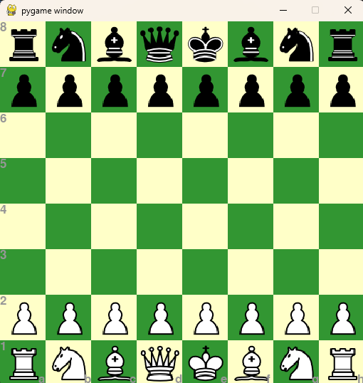

# GiriChess

A chess engine and interactive chess application built from scratch in Python using Pygame. The project focuses on understanding chess engine internals, including board representation, move generation, rule validation, check detection, game-state management, and eventually search and evaluation algorithms for an AI opponent.

<p align="center">
  
</p>

---

## Tech Stack

- **Language:** Python
- **GUI:** Pygame
- **Concepts:** Object-Oriented Programming, Game State Management, Move Generation, Rule Validation, Search Algorithms

---

## Features Completed

###  Project Setup
- Created a dedicated Python package for the chess engine.
- Organized the project into:
  - `ChessMain.py` – Handles the game loop, user input, rendering, and interaction.
  - `ChessEngine.py` – Maintains the game state, board representation, move execution, and move history.
  - `Pieces/` – Stores chess piece sprites used by the GUI.

---

###  Board Representation
- Implemented an 8×8 board using a 2D Python list.
- Represented each piece using two-character strings:
  - First character → Piece color (`w` / `b`)
  - Second character → Piece type (`K`, `Q`, `R`, `B`, `N`, `p`)
- Empty squares are represented as `--`.

Example:

```python
[
    ["bR","bN","bB","bQ","bK","bB","bN","bR"],
    ["bp","bp","bp","bp","bp","bp","bp","bp"],
    ...
    ["wp","wp","wp","wp","wp","wp","wp","wp"],
    ["wR","wN","wB","wQ","wK","wB","wN","wR"]
]
```

---

### Graphical User Interface

- Built the chessboard using the **Pygame** library.
- Implemented alternating light and dark squares.
- Loaded and scaled chess piece sprites dynamically.
- Rendered the complete board every frame.
- Implemented visual highlighting for legal moves.
- Added check-state highlighting to provide immediate visual feedback.
- Added animated piece movement for completed moves.



---

### User Interaction

- Added mouse-based piece selection.
- Implemented two-click move input:
  1. Select the piece.
  2. Select the destination square.
- Clicking the same square twice deselects the selected piece.
- Pressing `Z` undoes the last move.
- Legal moves are highlighted when a piece is selected.
- Check states are visually highlighted on the board.
- Pawn promotion currently supports piece selection through terminal input.

---

###  Move Execution
- Created a `Move` class to represent every chess move.
- Implemented move execution by updating the board state.
- Maintained a move log for move history and undo functionality.
- Implemented undo by restoring the previous board state.
- Generated coordinate notation (e.g., `e2e4`) for every move.
- Added special-move handling for en passant, pawn promotion and castling.


---

### Special Chess Rules

- Implemented **En Passant** pawn captures with appropriate game-state tracking.
- Implemented **Pawn Promotion** when a pawn reaches the opposite end of the board.
- Added terminal-based promotion piece selection.
- UI-based promotion selection is planned as part of the upcoming UI improvements.
- Implemented **Castling** with dedicated castling-rights tracking and validation of all required conditions.

---

### Legal Move Generation

- Implemented piece-wise move generation for all six chess pieces:
  - Pawn
  - Knight
  - Bishop
  - Rook
  - Queen
  - King
- Generated legal moves based on the current board state and side to move.
- Used a dispatch table (`moveFunctions`) to dynamically invoke piece-specific move generators.
- Implemented legal move filtering to prevent moves that leave the player's king in check.
- Added support for pinned pieces and double-check situations.
- Integrated special-move validation for castling, en passant, and pawn promotion.

---

### Check, Checkmate and Stalemate Detection

- Implemented check detection by identifying attacking pieces and attack directions.
- Implemented detection of pinned pieces.
- Implemented single-check and double-check handling.
- Implemented checkmate detection when the current player has no legal moves while in check.
- Implemented stalemate detection when the current player has no legal moves while not in check.

### Check Detection Optimization

Two approaches were implemented during development:

#### Naive Approach
- Determines whether the king is in check by generating the opponent's possible moves.
- Straightforward implementation used as a baseline/reference.

#### Optimized Approach
- Directly examines potential attacking pieces, pins, and attack directions.
- Avoids generating the complete opponent move list for every check evaluation.
- Used by the main engine to reduce the computational cost of repeated move validation.

The naive implementation is preserved separately as a development/reference branch, while the optimized implementation is used by the main engine.

---


## Current Status

✔ Board rendering complete

✔ Piece rendering complete

✔ Mouse interaction complete

✔ Move execution

✔ Undo functionality

✔ Move notation generation

✔ Legal move generation for all pieces

✔ Move validation framework

✔ Check detection

✔ Checkmate / Stalemate

✔ En Passant

✔ Pawn Promotion

✔ Castling

✔ UI improvements for legal moves and check states

✔ Piece animations for each move

🚧 UI-based pawn promotion selection

---

## Planned Features

- UI-based pawn promotion selection
- Board evaluation function
- Minimax search with Alpha-Beta pruning
- AI opponent
- Move ordering and search optimizations
- PGN/FEN support

