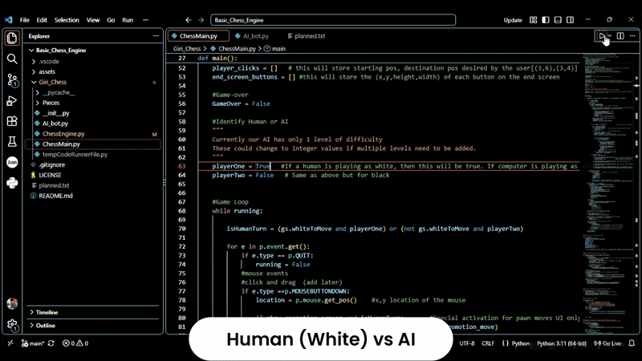
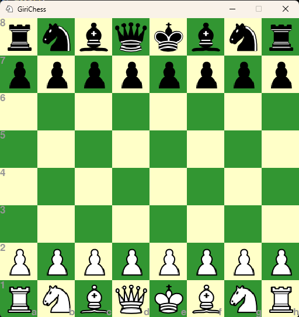

# GiriChess

A chess engine and interactive chess application built from scratch in **Python using Pygame**.

GiriChess implements the core rules and state-management systems required for a complete chess game, including legal move generation, special-move handling, check detection, game-state validation, and an interactive graphical interface.

The project is being developed incrementally from a **rules engine → playable application → chess AI**, with an emphasis on software engineering fundamentals, algorithmic efficiency, and modular design.

<p align="center">
  
</p>

---

## Tech Stack

* **Language:** Python
* **GUI:** Pygame
* **Architecture:** Object-Oriented Programming
* **Core Concepts:** Game State Management, Move Generation, Rule Validation, Algorithmic Optimization, Search Algorithms
* **AI:** Position Evaluation, Game-Tree Search

---

## Features

### Chess Engine

* 8×8 board representation using a 2D Python list
* Piece-specific move generation for:

  * Pawn
  * Knight
  * Bishop
  * Rook
  * Queen
  * King
* Legal move validation
* Pin detection
* Single-check and double-check handling
* Check, checkmate, and stalemate detection
* Optimized check detection through direct attack analysis
* Move history and undo functionality

### Special Chess Rules

* Castling with dedicated castling-rights tracking
* En passant with game-state tracking
* Pawn promotion with interactive piece selection
* Validation of special-move conditions

### Graphical User Interface

* Interactive chessboard built with Pygame
* Mouse-based piece selection and move execution
* Legal move highlighting
* Previous-move highlighting
* King-in-check highlighting
* Animated piece movement
* Graphical pawn promotion selection
* Checkmate and stalemate game-over screens
* Board reset and rematch functionality
* Custom application title and icon

<p align="center">
  
</p>

### Chess AI

GiriChess currently includes a basic **2-ply chess AI** capable of evaluating candidate moves by considering the resulting opponent response.

The current evaluation system considers:

* Material balance
* Checkmate opportunities
* Stalemate positions
* Resulting game states after candidate moves

The AI can currently operate in:

* **Human vs AI**
* **AI vs AI**

The current implementation is intentionally lightweight and serves as the foundation for deeper search and stronger evaluation.

---

## Check Detection

Two approaches to check detection were implemented during development.

### Naive Approach

The initial implementation determines whether a king is in check by generating the opponent's possible moves.

This implementation is preserved in a separate Git branch as a reference and baseline implementation.

### Optimized Approach

The main engine directly examines potential attackers, pins, and attack directions rather than repeatedly generating the opponent's complete move list.

This reduces unnecessary move generation during repeated check and legal-move validation and provides a more efficient foundation for search-based AI.

---

## AI Development

The AI is being developed incrementally alongside the chess engine.

### Current

* 2-ply move evaluation
* Material-based position scoring
* Checkmate detection during evaluation
* Stalemate detection during evaluation
* Human vs AI
* AI vs AI

### Planned

* Minimax search
* Alpha-Beta pruning
* Move ordering
* Search optimizations
* Improved positional evaluation
* Engine benchmarking

The goal is to evolve the current lightweight decision-making system into a deeper search-based chess engine while keeping the underlying rules engine independent from the AI layer.

---

## Project Structure

```text
GiriChess/
├── Giri_Chess/
│   ├── ChessMain.py
│   ├── ChessEngine.py
│   └── AI_bot.py
├── assets/
│   ├── Board_v2.png
│   └── demo_v5.gif
├── README.md
└── DEVELOPMENT_LOG.md
```

---

## Development Roadmap

### Phase 1 — Chess Rules Engine ✅

* Board representation
* Move generation
* Legal move validation
* Check / checkmate / stalemate
* Pin and double-check handling
* En passant
* Pawn promotion
* Castling
* Optimized check detection

### Phase 2 — Playable Chess Application ✅

* Move highlighting
* Check highlighting
* Previous-move highlighting
* Move animations
* Promotion UI
* Game-over UI
* Board reset / rematch
* Human vs Human gameplay

### Phase 3 — Chess Intelligence 🚧

* Position evaluation
* 2-ply AI
* Minimax
* Alpha-Beta pruning
* Move ordering
* Search optimization
* AI benchmarking

### Phase 4 — Full Chess Application

* Timers
* Move history UI
* Evaluation bar
* Engine analysis
* PGN / FEN support
* Game review and analysis
* Persistent game storage
* Settings

### Phase 5 — Distribution

* Standalone offline executable
* Packaging
* Testing
* Performance optimization
* Application polishing
* Distribution

---

## Current Status

**GiriChess has completed its core chess rules engine and playable application.**

The current development focus is **Chess Intelligence**, with a basic 2-ply AI already implemented and deeper search algorithms planned as the next step.

The project is intentionally being developed incrementally, allowing each layer — rules, interface, and intelligence — to remain independently testable and extensible.

---

## Future Direction

The long-term goal is to turn GiriChess into a complete, standalone chess application backed by a progressively stronger chess engine.

Potential future milestones include deeper search, engine benchmarking, game analysis, persistent game storage, and standalone application distribution.

