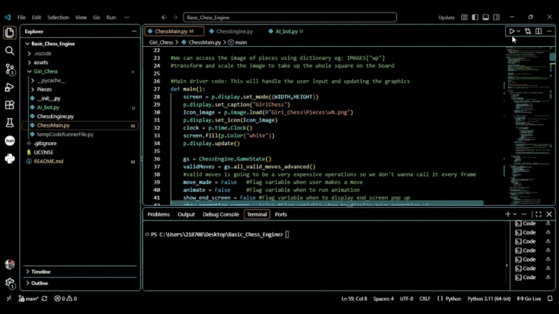

# GiriChess

A chess engine and interactive chess application built from scratch in Python using Pygame. The project focuses on implementing chess rules, legal move generation, game-state management, and efficient check detection. The project currently focuses on chess-engine fundamentals, with position evaluation and search-based AI planned as the next development phase.


<p align="center">
  
</p>

---

## Tech Stack

- **Language:** Python
- **GUI:** Pygame
- **Concepts:** Object-Oriented Programming, Game State Management, Move Generation, Rule Validation, Algorithimic Optimization

---

## Features

### Chess Engine

- 8×8 board representation using a 2D Python list
- Piece-specific legal move generation for:
  - Pawn
  - Knight
  - Bishop
  - Rook
  - Queen
  - King
- Legal move validation
- Pin detection
- Single-check and double-check handling
- Check, checkmate, and stalemate detection
- Optimized check detection
- Move history and undo functionality

### Special Chess Rules

- Castling with dedicated castling-rights tracking
- En passant with game-state tracking
- Pawn promotion with interactive piece selection
- Validation of special-move conditions

### Graphical User Interface

- Built an interactive chessboard using Pygame.
- Implemented mouse-based piece selection and move execution.
- Added visual highlighting for:
  - Legal moves
  - The most recently played move
  - King in check
- Added animated piece movement.
- Added graphical pawn promotion selection.
- Added game-over screen for checkmate and stalemate.
- Added rematch/reset functionality.
- Added custom application title and icon.


---

## Check Detection

Two approaches to check detection were implemented during development.

### Naive Approach

The naive implementation determines whether a king is in check by generating the opponent's possible moves.

This implementation is preserved in a separate Git branch as a reference and baseline implementation.

### Optimized Approach

The main engine directly examines potential attackers, pins, and attack directions instead of repeatedly generating the opponent's complete move list.

This reduces the computational cost of repeated check and legal-move validation.

---

## Project Structure

```text
GiriChess/
├── Giri_Chess/
│   ├── ChessMain.py
│   ├── ChessEngine.py
│   └── Pieces/
├── assets/
├── README.md
└── DEVELOPMENT_LOG.md
```

---

## Current Status

### Completed

✔ Complete board and piece rendering  
✔ Legal move generation for all pieces  
✔ Legal move validation  
✔ Check detection  
✔ Pin and double-check handling  
✔ Checkmate and stalemate detection  
✔ Castling  
✔ En passant  
✔ Pawn promotion  
✔ Move history and undo  
✔ Legal move highlighting  
✔ Check highlighting  
✔ Previous-move highlighting  
✔ Move animations  
✔ Pawn promotion UI  
✔ Game-over screen  
✔ Board reset / rematch functionality  

### In Development

🚧 Board evaluation  
🚧 Minimax search with Alpha-Beta pruning  
🚧 AI opponent  

---

## Planned Features

- Move ordering and search optimizations
- PGN/FEN support
- Game review and analysis
- Persistent game storage
- Standalone offline executable
